# Serverless Web Application with AppSync Workshop

<a href="https://www.youtube.com/watch?v=sQN28Jo-nak" target="_blank">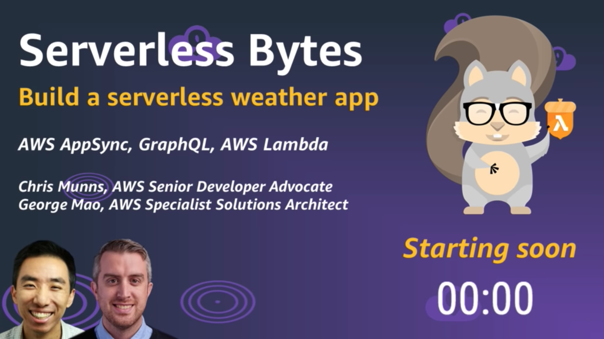</a>
<br />
Follow along this workshop on <a href="https://www.youtube.com/watch?v=sQN28Jo-nak" target="_blank">YouTube</a>.

This workshop shows you how easy it is to build a data driven web applications all with no servers. You will build a serverless web application that lets users search for popular tourist destinations. The application will provide real-time weather analysis of the indexed destinations.

You will host your web application's static assets on Amazon S3 and use S3 to deliver the web application to your users. The application will integrate with AWS AppSync to provide real-time data from multiple data sources via GraphQL technology. Destination data will be stored in Amazon DynamoDB and AWS Lambda will query for real time weather information. AppSync will make it easy to access this data and provide the exact information our application needs.

The application architecture uses [Amazon S3](https://aws.amazon.com/s3/) to host the static web resources including our ReactJS based frontend (HTML, CSS, JavaScript, and image files). The application is loaded by the user's browser and interacts with our API layer built using, [AWS AppSync](https://aws.amazon.com/appsync/). AppSync provides realtime query capability to search for the list of travel destinations stored in [Amazon DynamoDB](https://aws.amazon.com/dynamodb/). AppSync makes it easy to combine data from [AWS Lambda](https://aws.amazon.com/lambda/) to provide realtime weather information for each destination.

See the diagram below for a depiction of the complete architecture:

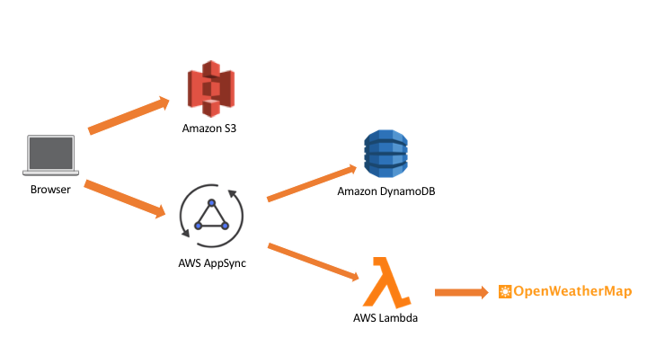

## Prerequisites

1. Signup for a free OpenWeatherApp account here: https://openweathermap.org/appid. Make sure you note the assigned api key.
2. [Provision](https://docs.aws.amazon.com/cloud9/latest/user-guide/tutorial.html) an AWS Cloud9 instance.

### AWS Account

In order to complete this workshop you'll need an AWS Account with access to create AWS IAM, S3, DynamoDB, Lambda, and AppSync resources. The code and instructions in this workshop assume only one developer is using a given AWS account at a time. If you try sharing an account with another developer, you'll run into naming conflicts for certain resources. You can work around these by appending a unique suffix to the resources that fail to create due to conflicts, but the instructions do not provide details on the changes required to make this work.

All of the resources you will launch as part of this workshop are eligible for the AWS free tier if your account is less than 12 months old. See the [AWS Free Tier page](https://aws.amazon.com/free/) for more details.

### Browser

We recommend you use the latest version of Chrome to complete this workshop.

### AWS Cloud9 or a Text Editor

The instructions below assume you are using Cloud9 to build this application. You can optionally choose to use any Text editor.

## Implementation Instructions

### Region Selection

This workshop can be deployed in any AWS region that supports the following services:

- AWS Lambda
- Amazon AppSync
- Amazon S3
- Amazon DynamoDB

You can refer to the [region table](https://aws.amazon.com/about-aws/global-infrastructure/regional-product-services/) in the AWS documentation to see which regions have the supported services. Among the currently supported regions you can choose are: **N. Virginia, Ohio, Oregon, Ireland, Frankfurt, Singapore, Tokyo, Sydney, and Mumbai**.

Once you've chosen a region, you should deploy all of the resources for this workshop there. Make sure you select your region from the dropdown in the upper right corner of the AWS Console before getting started.


### Step 0: Prepare Cloud9 Workspace
Download all files from the Github repo.
Upload them to your Cloud9 workspace (File -> Upload Local files ...)

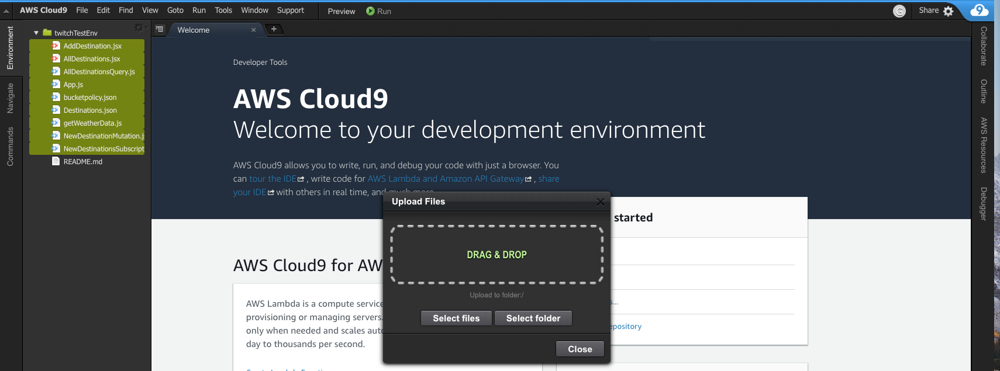

### Step 1: Create your DynamoDB Table
Execute following CLI command to create a table called: **AppSync-Destinations**

    aws dynamodb create-table --table-name AppSync-Destinations --attribute-definitions AttributeName=id,AttributeType=S --key-schema AttributeName=id,KeyType=HASH --provisioned-throughput ReadCapacityUnits=10,WriteCapacityUnits=10

Execute the following CLI command to load the table with a few travel destinations:

    aws dynamodb batch-write-item --request-items file://Destinations.json

### Step 2: Create your Lambda Function

This function will get the latest weather data from the OpenWeather API. The function will be written in NodeJS.

- Switch back to your AWS Cloud9 IDE and create a new Lambda function.
- Select the AWS Resources tab on the right.
- Click "Create a new Lambda Function"
- For Function name, enter: **getWeatherData**

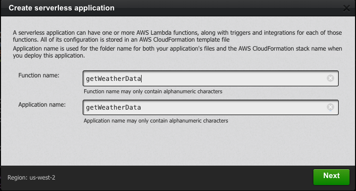

Click *Next* and select **empty-nodejs**

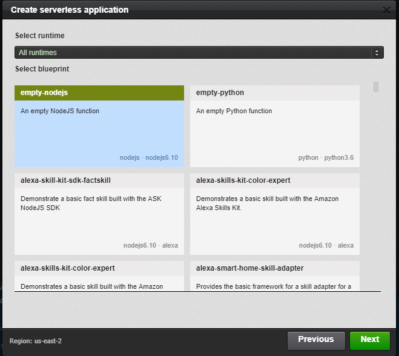

- Click **Next**, accept all defaults and **Finish**.
- On the left, expand your **getWeatherData** folder and open **index.js**.
- Copy the provided source code from **getWeatherData.js** and paste it into **index.js**.
- Open the **template.yaml** file and add the following environment variable to the bottom of the template. This is your OpenWeather API key. Replace with your OpenWeather API key:
- Make sure you Save your changes!

```yaml
Environment:
    Variables:
        APPID: YOUR_API_KEY_HERE
```

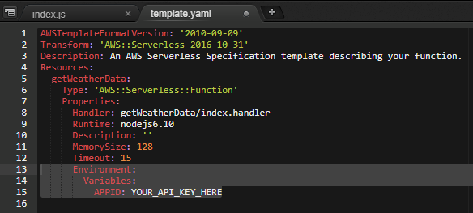

Right click your function and select **Deploy**

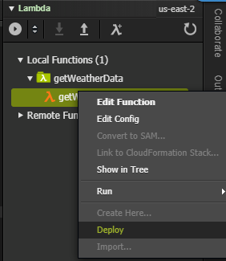

### Step 3: Create your AppSync API backend

Open the AWS AppSync Console and click  **Create API**. Choose **Build from Scratch** and click **Start**.
Enter a name for your API and click **Create**

On the next screen, scroll down to the "Integrate your app" section and download your *aws-exports.js* config file. Choose the **Javascript** tab and click **Download Config**. You will save this file into your ./src directory later.

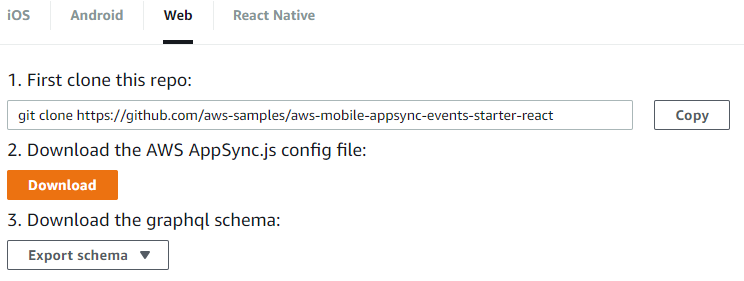

### Setup your data sources

We will be using DynamoDB and Lambda as our data sources

- On the left pane, Select **Data Sources**. For the name enter **Destinations**. 
- Select the table you created in the previous step and click **Create**

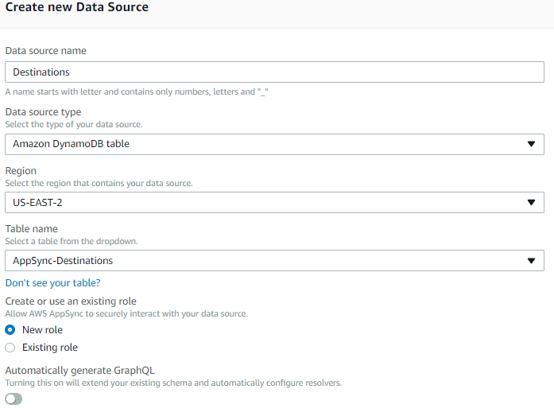


- On the left pane, Select **Data Sources**. For the name enter **WeatherConditions**. 
- For data source type select AWS Lambda function. Then Select the getWeatherData function you created in the previous step and click **Create**

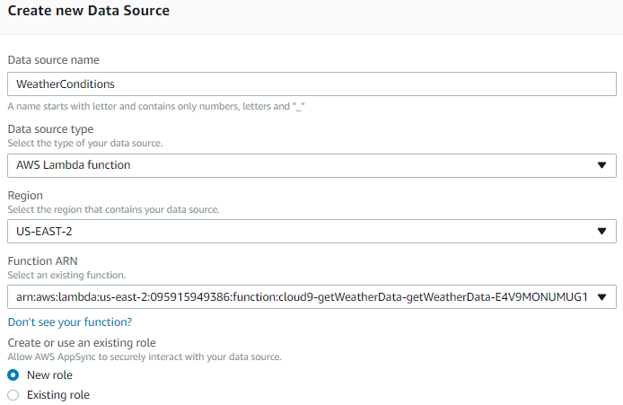

### Setup your AppSync Schema

- On the left pane, select **Schema**.
- Copy and paste the following into the Schema editor and click **Save**:

```js
type Destination {
	id: ID!
	description: String!
	state: String!
	city: String!
	zip: String!
	conditions: Weather!
}

type Mutation {
	addDestination(
		id: ID,
		description: String!,
		state: String!,
		city: String!,
		zip: String!
	): Destination!
}

type Query {
	# Get a single value of type 'Post' by primary key.
	getDestination(id: ID!, zip: String): Destination
	getAllDestinations: [Destination]
	getDestinationsByState(state: String!): [Destination]
}

type Subscription {
	newDestination: Destination
		@aws_subscribe(mutations: ["addDestination"])
}

type Weather {
	description: String
	current: String
	maxTemp: String
	minTemp: String
}

schema {
	query: Query
	mutation: Mutation
	subscription: Subscription
}
```

### Configure the Query resolvers

- Scroll to the Query section, locate *getAllDestinations: [Destination]* and click **Attach**.
- For the *Data source name* choose **Destinations**.
- In the *Configure request mapping template* box, choose **List items**
- In the *Configure response mapping template* box, choose **Return a list of results**
- Click Save

#### Optional: Connect the getDestinationsByState Query Resolver

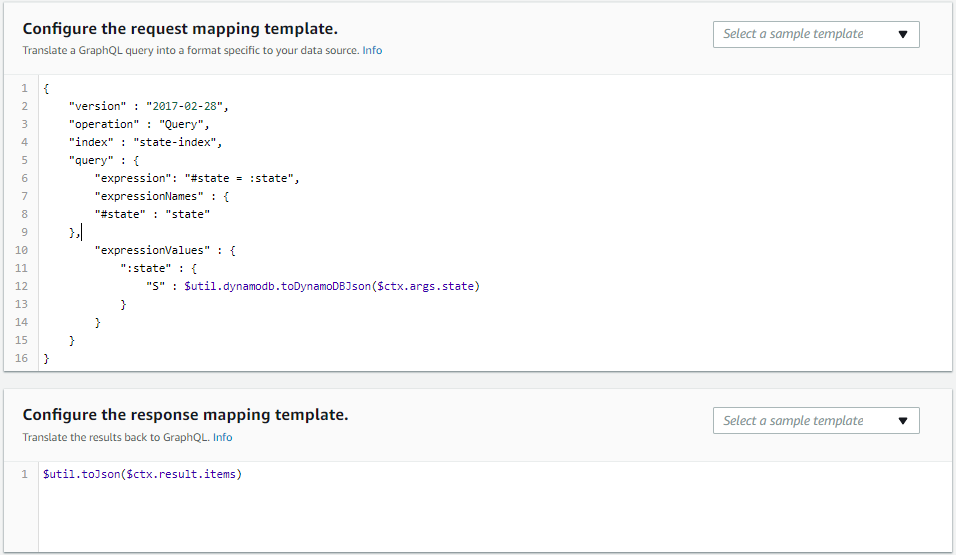

### Configure the Weather resolver
- Scroll to the *Destination* section and click **Attach** for *conditions: Weather!*.
- For the *Data source name* choose **WeatherConditions**.
- In the *Configure request mapping template* box, enter the following JSON in the box:

```js
{
    "version" : "2017-02-28",
    "operation": "Invoke",
    "payload": {
      "city":$util.toJson($context.source.city)
    }
     
}
```

This will grab the results from the parent DynamoDB query and pass the *city* attribute into the Lambda function as the payload. The *$context.source* attribute contains the result of the parent query. 

In the *Configure response mapping template* box, choose **Return Lambda Result**.
Your configuration should look similar to this:

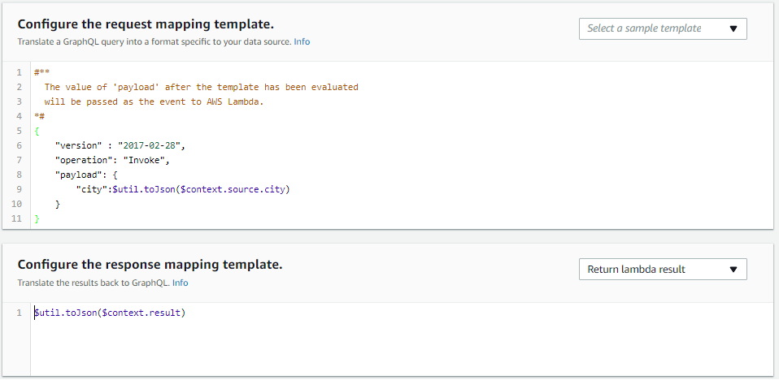

### Configure the Mutuation resolver
- For the *Data source name* choose **Destinations**.
- In the *Configure request mapping template* box, choose **Put Item**
- In the *Configure response mapping template* box, choose **Return a single item**
- Accept all defaults. Pay attention to autoId.

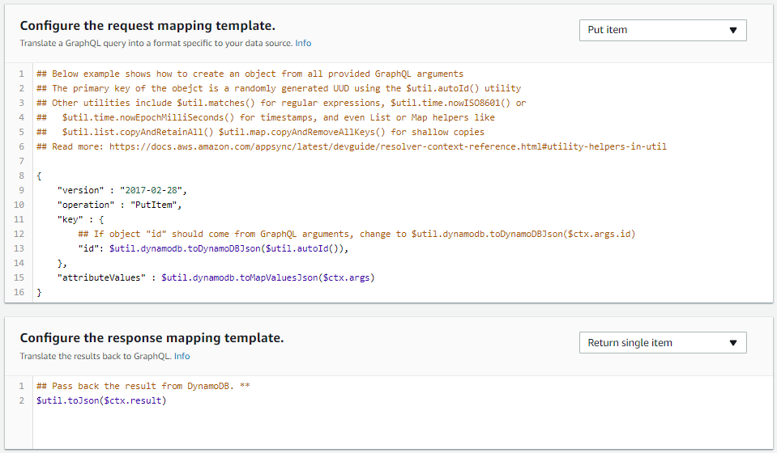

### Step 4: Implement your ReactJS web front end
Switch back to the AWS Cloud9 IDE.
Upload the *aws-exports.js* file you downloaded in the previous step to your Cloud9 workspace

Create your ReactJS project (this step will take a few minutes):

```bash
npm install -g npx
npx create-react-app my-destination-app
cd my-destination-app
```

Test your base ReactJS site by starting the local server:
```bash
npm start
```
- Preview the ReactJS site: Select **Preview** -> **Preview Running Application**

Enter **Control + C ** to shutdown the web server.

Install AppSync dependencies:
```bash
npm install --save react-apollo graphql-tag aws-sdk
npm install --save aws-appsync 
npm install --save aws-appsync-react
npm install --save react-router-dom
npm install --save semantic-ui-css
```

Under the */my-destination-app/src* folder create a **Components** folder and a **Queries** folder
Drag and drop files you downloaded into *src* as follows:

    App.js
    aws-exports.js
    Components
        AddDestination.jsx
        AllDestinations.jsx
    Queries
        AllDestinationsQuery.js
        NewDestinationMutation.js
        NewDestinationsSubscription.js


### Step 5: Deploy your ReactJS front end

Create S3 bucket for static website hosting:
```bash
aws s3 mb s3://[YOUR-BUCKET-NAME]
aws s3 website s3://[YOUR-BUCKET-NAME]/ --index-document index.html
```

- Edit *bucketpolicy.json* and enter your bucket name on line 9
- Set the bucket policy as follows:

```bash
aws s3api put-bucket-policy --bucket [YOUR-BUCKET-NAME] --policy file://bucketpolicy.json
```

Compile and package the app for deployment to S3:
```bash
cd my-destination-app
npm run build
```

The distributables will be in the /build folder. Change directory into the build folder
```
cd build
```

Sync the contents to s3:
```bash
aws s3 sync . s3://[YOUR-BUCKET-NAME]/
```

### Step 6: Test!
Bring up the S3 console. Goto Static website Hosting and click the link or type this in your browser:
http://[yourbucketname].s3-website.[region].amazonaws.com

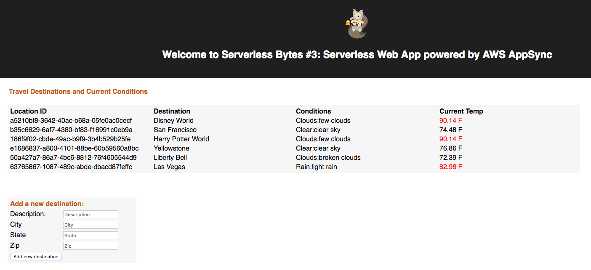

#### Test AppSync realtime capabilities

AppSync uses WebSockets to provide realtime data sync.
Try adding a new destination through a Mutation and watch the results populate in realtime:

Goto the AppSync Console, click the Queries section and run the following mutation:

```javascript
mutation addDestination{
addDestination(
description:"Space Needle"
    city: "Seattle"
    state: "Washington"
    zip: "98109"
){
    __typename
    id
    description
    city
    state
    zip
    conditions{
    __typename
    maxTemp
    minTemp
    current
    description
    }
}
}
```

You should see the new *Space Needle* destination populate in your browser:


## License Summary

This sample code is made available under a modified MIT license. See the LICENSE file. 
